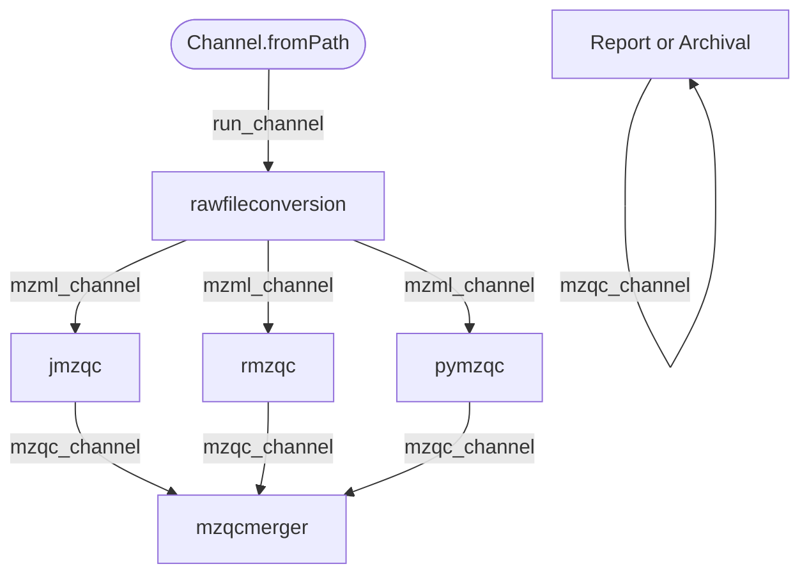

# mzQC Implementation-Cases (formerly usecases)
The main focus of this workflow is _not_ to analyse data, but to _showcase_ the existing implementations of mzQC, how to combine them or their result files, and how to quickly create new uses. Basic knowledge of the command line and singularity is recommended, since you will need both. 

## The Workflow

### Bash
You can use `workflow.sh` to automate the example workflow. You will need to accomodate for where your input and config files are, take a look inside the script how to.

### Workflow Data Input 
We tested several data sets to most effectively demonstrate the capabilities of the mzQC implemntations in a short form. Pease see the last entry for the current, i.e.latest test input.

1. QC Sample run (BSA + iRT standard) from rawR
- Folder autoQC
- File 20181113_010_autoQC01.raw
> This data set contains raw files described in "rawR - Direct access to raw mass spectrometry data in R" available at https://www.biorxiv.org/content/10.1101/2020.10.30.362533v1.full The analyzed sample (autoQC01) consists of the iRT peptide mix (Biognosys) in a tryptic BSA digest (NEB). [doi:10.25345/C5MZ14] 

2. Biological samples in DDA mode + iRT standard
- Folder N/A
- File QEXI21822_F15.raw 
- PXD013487: https://ftp.pride.ebi.ac.uk/pride/data/archive/2020/08/PXD013487/QEXI21822_F15.raw
> Cerebrospinal fluid samples of patients with Parkinson's disease and healthy controls were used for this study. Part of the samples consisted of fractions that were separated by gel electrophoresis. After tryptic digestion, all samples were spiked with indexed retention time (iRT) peptides and were measured using a DDA mass spectrometry approach. 
> NOTE: Not to be confused with the DIA part of [doi:10.1002/ctm2.357] (which is PXD022234)

3. Metabo QC DDA + internal standards
- Folder: N/A
- File: 20100917_01_TomQC.mzML
- MTBLS36: https://ftp.ebi.ac.uk/pub/databases/metabolights/studies/public/MTBLS36/20100917_01_TomQC.mzML
>Application of mass spectrometry enables the detection of metabolic differences between groups of related organisms. Differences in the metabolic fingerprints of wild-type Solanum lycopersicum and three monogenic mutants, ripening inhibitor (rin), non-ripening (nor) and Colourless non-ripening (Cnr), of tomato are captured with regard to ripening behaviour. A high-resolution tandem mass spectrometry system coupled to liquid chromatography produced a time series of the ripening behaviour at discrete intervals with a focus on changes post-anthesis. Internal standards and quality controls were used to ensure system stability. The raw data of the samples and reference compounds including study protocols have been deposited in the open metabolomics database MetaboLights via the metadata annotation tool Isatab to enable efficient re-use of the datasets, such as in metabolomics cross-study comparisons or data fusion exercises.

4. Drosophila
- Folder: PXD000455
- File: all
- PXD000455: https://ftp.pride.ebi.ac.uk/pride/data/archive/2013/11/PXD000455/
>Self-described high coverage dataset of whole Drosophila melanogaster Canton-S. Difference of reanlysis and original insurmountable.

5. Broccoli
- Folder: PXD040621
- File: all
- PXD040621: https://ftp.pride.ebi.ac.uk/pride/data/archive/2023/07/PXD040621/
> Study on broccoli derived sulforaphane influencing bacteria of the gut-microbiome. Includes a simple proteomics experiment, 8 batches of E. coli grown in two groups of media, measured with QExactive+, label-free quantitative analysis with MQ followed. As a bonus, the publication also has a related metabolomics experiment.

### Data analysis
Once the script is finshed or you have successfully created mzqc files from your input with all metric calculating scripts provided, then merged the mzqc files, you are ready to create a report or interactively explore the QC of your input with the `mzqclibs-notebook.ipynb`.

### Workflow Flowchart 
For more details on the flowchart generation for the workflow, see [here](workflow-usecase.md)
