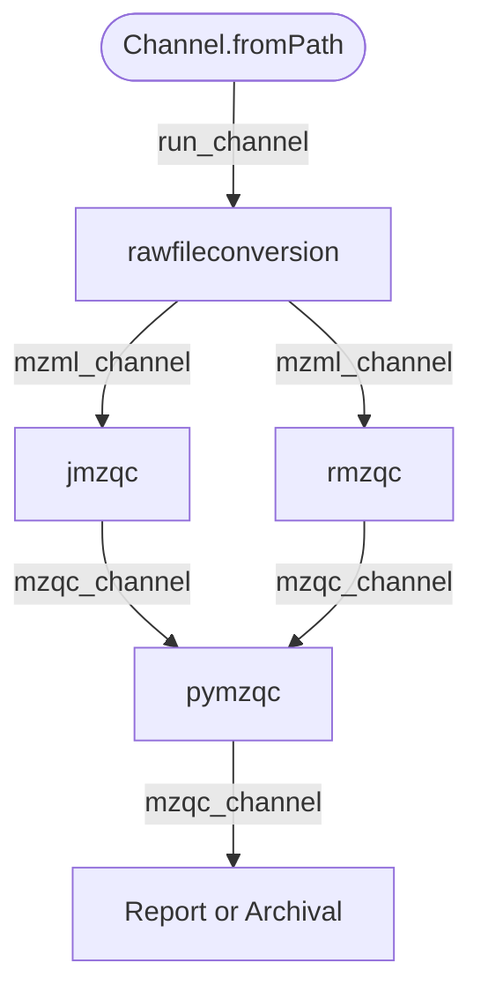
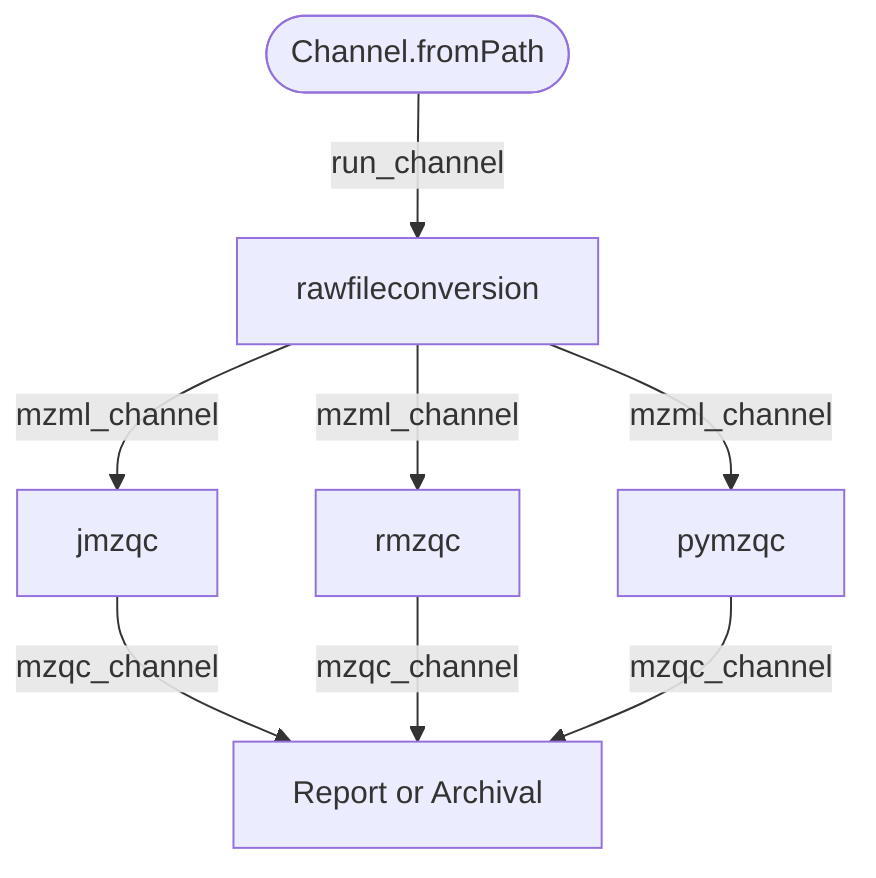

## Create a workflowchart from nextflow
To produce a mermaid file for 'pretty' workflow visualisation from the workflow, use
```
nextflow run 'mzqc-usecases.nf'  -with-dag flowchart.mmd --run test.raw -stub
```
## Current capability:


## Originally planned:

